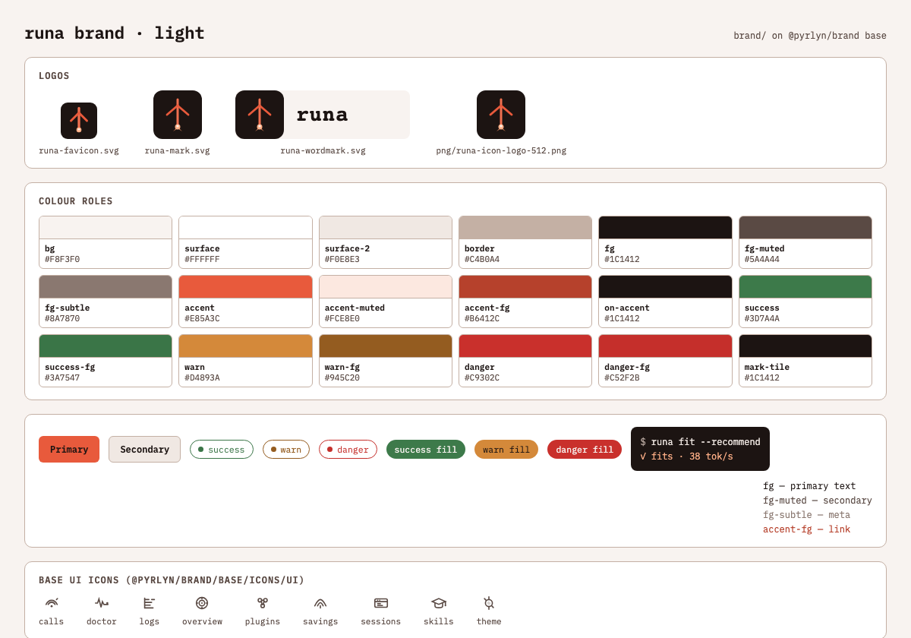
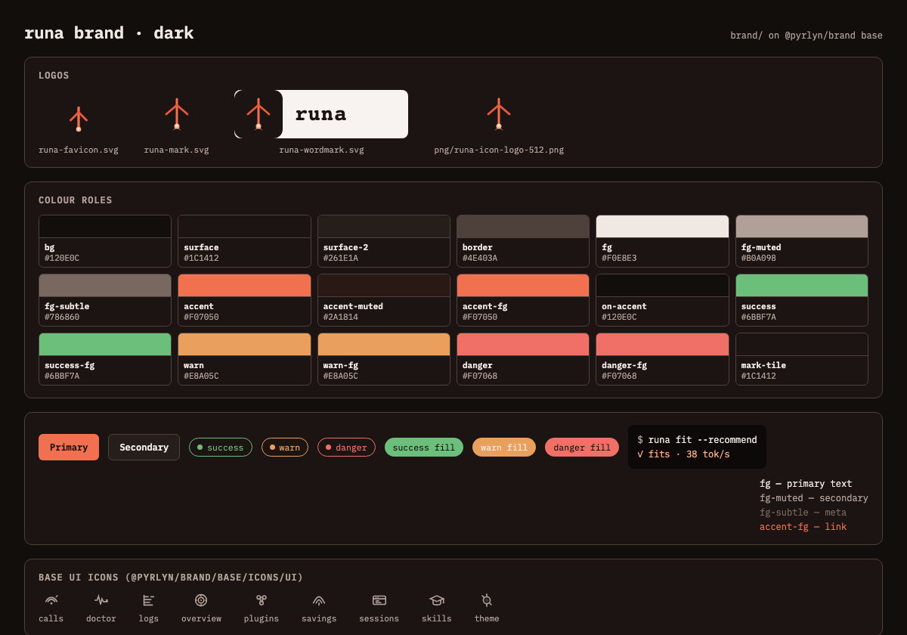

# runa brand

This folder is the **source of truth for the runa brand**: logos, colour tokens and the brandbook (`DESIGN.md`) of runa. It holds only what is
specific to runa. Everything the Pyrlyn products share (type scale, spacing, radii, sizes,
breakpoints, motion, the semantic colour roles, IBM Plex Mono, the UI icons and the `.pyr-*`
components) is the **Pyrlyn base layer** in [pyrlyn/brand](https://github.com/pyrlyn/brand) `base/`,
and this pack inherits it instead of copying it.

## Inheritance: base from pyrlyn/brand, runa deltas here

| Layer | Lives in | Provides |
|---|---|---|
| Base | [pyrlyn/brand `base/`](https://github.com/pyrlyn/brand/tree/v0.4.0/base), installed as `@pyrlyn/brand` | tokens (`--pyr-*` scales), the list of colour roles and their fallbacks, fonts, UI icons, components |
| runa | this folder | the colour roles per theme (`--pyr-bg`, `--pyr-accent` …), runa's own tokens (`--runa-*`), logos |

- `package.json` pins the base: `"@pyrlyn/brand": "github:pyrlyn/brand#v0.4.0"`;
  `package-lock.json` locks it to commit `4dbf9a3`.
- `tokens.json` has `"$extends": "@pyrlyn/brand/base/tokens.json"` and only sets runa's values.
- `node build.mjs` merges the two and writes `dist/tokens.css`, which starts with
  `@import "@pyrlyn/brand/base/tokens.css";` and then sets the roles, plus `dist/tokens.resolved.json`.
- No base file or value is copied into this folder. Roles runa leaves empty use the base fallback
  (listed in the table below).

**Where to change what.** runa colours, logos and `DESIGN.md`: here, in a runa PR.
Shared tokens, fonts, UI icons, components or the role list: in pyrlyn/brand `base/` first, then bump the
tag in `package.json`, run `npm install` and `node build.mjs` here.

**Origin.** New pack, built the same way as the rtok, ketch and cox packs (same `build.mjs`). The values come from
`docs/brand/DESIGN.md` and `docs/brand/tokens.css` at `947399f`; pyrlyn/brand never had a `brands/runa`.

## Use

```sh
cd brand && npm ci          # installs the pinned @pyrlyn/brand into brand/node_modules
npm run build               # regenerate dist/ and the token table below
npm run check               # CI-style check: exit 1 if dist/ or the table is stale
```

In a bundler (Vite, PostCSS, Tailwind v4, esbuild) import the runa tokens, then the base fonts and,
if wanted, the base components; the bare `@pyrlyn/brand/…` specifiers resolve through
`brand/node_modules`:

```css
@import "<path to>/brand/dist/tokens.css";   /* base tokens + runa roles (--pyr-*) + --runa-* */
@import "@pyrlyn/brand/base/fonts.css";      /* IBM Plex Mono */
@import "@pyrlyn/brand/base/components.css"; /* .pyr-btn, .pyr-chip … in runa colours */
```

Plain HTML has no module resolution: link `brand/node_modules/@pyrlyn/brand/dist/base/tokens.css`
before `brand/dist/tokens.css`. UI icons: `@pyrlyn/brand/base/icons/ui/*.svg` (runa has no icons of its own).

Light is runa's default theme (the `:root` of `docs/brand/tokens.css`); dark is first-class.

## Layout

```text
brand/
  package.json, package-lock.json  pins @pyrlyn/brand (base) to v0.4.0
  tokens.json      runa roles + --runa-* extras, extends @pyrlyn/brand/base/tokens.json
  build.mjs        -> dist/tokens.css, dist/tokens.resolved.json, the table below
  DESIGN.md        runa brandbook (deltas only)
  logo/ (+png/)    mark, wordmark, favicon; PNG exports
  preview/         light/dark preview PNGs
```

## Tokens

<!-- BEGIN TOKEN TABLE (generated by build.mjs, do not edit) -->
Base: `@pyrlyn/brand` 0.4.0 (`github:pyrlyn/brand#v0.4.0`). AA = lowest contrast of a text role on `bg`, `surface` and
`surface-2` (`on-accent`: on `accent`); ✓ ≥ 4.5:1. Roles without a value use the base fallback shown.

Brand constants: `--runa-brand-charcoal` `#1C1412` · `--runa-brand-ember` `#E85A3C` · `--runa-brand-ember-glow` `#FFB088` · `--runa-brand-ember-deep` `#C94830`

| Role | CSS variable | light (default) | light AA | dark | dark AA |
|---|---|---|---|---|---|
| `bg` | `--pyr-bg` | `#F8F3F0` |  | `#120E0C` |  |
| `surface` | `--pyr-surface` | `#FFFFFF` |  | `#1C1412` |  |
| `surface-2` | `--pyr-surface-2` | `#F0E8E3` |  | `#261E1A` |  |
| `border` | `--pyr-border` | `#C4B0A4` |  | `#4E403A` |  |
| `fg` | `--pyr-fg` | `#1C1412` | 14.99 ✓ | `#F0E8E3` | 13.53 ✓ |
| `fg-muted` | `--pyr-fg-muted` | `#5A4A44` | 6.95 ✓ | `#B0A098` | 6.49 ✓ |
| `fg-subtle` | `--pyr-fg-subtle` | `#8A7870` | 3.47 ✗ (large text only) | `#786860` | 3.08 ✗ (large text only) |
| `accent` | `--pyr-accent` | `#E85A3C` |  | `#F07050` |  |
| `accent-muted` | `--pyr-accent-muted` | `#FCE8E0` |  | `#2A1814` |  |
| `mark-tile` | `--pyr-mark-tile` | `#1C1412` |  | `#1C1412` |  |
| `surface-3` | `--pyr-surface-3` | `#E6D9D1` |  | `#322824` |  |
| `accent-fg` | `--pyr-accent-fg` | `#B6412C` | 4.59 ✓ | `#F07050` | 5.56 ✓ |
| `on-accent` | `--pyr-on-accent` | `#1C1412` | 5.15 ✓ | `#120E0C` | 6.53 ✓ |
| `delta-fg` | `--pyr-delta-fg` | `#E85A3C (base fallback)` | 2.91 ✗ | `#F07050 (base fallback)` | 5.56 ✓ |
| `danger` | `--pyr-danger` | `#C9302C` |  | `#F07068` |  |
| `danger-fg` | `--pyr-danger-fg` | `#C52F2B` | 4.55 ✓ | `#F07068` | 5.63 ✓ |
| `success` | `--pyr-success` | `#3D7A4A` |  | `#6BBF7A` |  |
| `success-fg` | `--pyr-success-fg` | `#3A7547` | 4.55 ✓ | `#6BBF7A` | 7.29 ✓ |
| `warn` | `--pyr-warn` | `#D4893A` |  | `#E8A05C` |  |
| `warn-fg` | `--pyr-warn-fg` | `#945C20` | 4.55 ✓ | `#E8A05C` | 7.49 ✓ |
| `shadow-e1` | `--pyr-shadow-e1` | `0 1px 2px rgba(28, 20, 18, 0.06), 0 4px 12px rgba(28, 20, 18, 0.04)` |  | `0 1px 2px rgba(0, 0, 0, 0.35), 0 4px 16px rgba(0, 0, 0, 0.28)` |  |
| runa extra | `--runa-accent-hover` | `#C94830` | | `#FF9A6A` | |
| runa extra | `--runa-ember` | `#FF9A6A` | | `#FFB088` | |
| runa extra | `--runa-info` | `#5A6B8A` | | `#8A9BB8` | |
| runa extra | `--runa-surface-pressed` | `#D8C8BE` | | `#403430` | |
| runa extra | `--runa-border-hairline` | `#E0D4CC` | | `#2A221E` | |
| runa extra | `--runa-code-bg` | `#1C1412` | | `#0C0908` | |
| runa extra | `--runa-code-fg` | `#FFB088` | | `#FFB088` | |
| runa extra | `--runa-glass-fill` | `rgba(255, 255, 255, 0.72)` | | `rgba(28, 20, 18, 0.72)` | |
| runa extra | `--runa-glass-border` | `rgba(224, 212, 204, 0.9)` | | `rgba(42, 34, 30, 0.9)` | |
| runa extra | `--runa-accent-glow` | `0 0 0 3px var(--pyr-accent-muted), 0 0 18px rgba(232, 90, 60, 0.22)` | | `0 0 0 3px var(--pyr-accent-muted), 0 0 20px rgba(240, 112, 80, 0.28)` | |
<!-- END TOKEN TABLE -->

## Changes against `docs/brand/`

- **Role names** follow the base: `bg-elevated`→`surface`, `surface-1`→`surface-2`, `surface-2`→`surface-3`,
  `accent-soft`→`accent-muted`, `shadow`→`shadow-e1`. runa's own `accent-muted` (`#F07050` light, `#E85A3C` dark),
  `accent-hover`, `ember`, `info`, `surface-3` (as `surface-pressed`), `border-hairline`, `code-*`, `glass-*` and
  `accent-glow` are kept as `--runa-*`; the ember family is also exposed as brand constants
  (`--runa-brand-ember` `#E85A3C`, `-ember-glow` `#FFB088`, `-ember-deep` `#C94830`).
- **`on-accent`** is new (`docs/brand/` has none): warm charcoal `#1C1412` on the light ember fill (5.15:1;
  white would be 3.52:1) and `#120E0C` on the dark accent (6.53:1). The base fallback (`bg`) would fail on light.
- **Status colours**: fills are `docs/brand/tokens.css` `success`, `warning` (as `warn`) and `danger`. `docs/brand/`
  has no text variants, and on light the fills are below AA as text (4.25, 2.33 and 4.40:1), so the light
  `success-fg` `#3A7547`, `warn-fg` `#945C20` and `danger-fg` `#C52F2B` are the same hues darkened just enough to
  pass 4.5:1 on `bg`, `surface` and `surface-2`. On dark the fills already pass and are reused as text.
- **`accent-fg`** (accent as text) is new: on light the ember `#E85A3C` is 2.91:1 and the hover `#C94830` 3.90:1, so
  `#B6412C` (the hover hue, darkened to 4.59:1); on dark the accent itself (5.56:1).

## Checked against the product

- `logo/runa-mark.svg`, `runa-wordmark.svg` and `runa-favicon.svg` are byte-identical to `docs/brand/logo.svg`,
  `logo-wordmark.svg` and `favicon.svg`. The PNGs in `logo/png/` are rendered from those SVGs.
- Every other colour in `tokens.json` is a value from `docs/brand/tokens.css`, which matches `docs/brand/DESIGN.md`.
- The project site (pyrlyn/landing) uses the same ember family for runa: accent `#E85A3C`, accent2 `#FFB088`,
  accentLight `#C94830` on `#120E0C`.

## Known gaps

- `fg-subtle` (light `#8A7870`, 3.47:1; dark `#786860`, 3.08:1) is `docs/brand/`'s value and was left unchanged; use it
  for meta and large text only.
- The light `warn` fill `#D4893A` is 2.33:1 on `bg`: use it with an outline or an `fg` label, never as text (use `warn-fg`).
- `delta-fg` is not set (runa has no delta role) and falls back to `accent`, which is below AA as text on light.
- The dark `mark-tile` `#1C1412` equals the dark `surface`: on a dark card the logo tile needs a `border` to stand out.
- The wordmark's live text is `#1C1412`, so it is for light grounds only; there is no on-dark wordmark yet.
  No wordmark PNG: the wordmark is live text, so a raster depends on the installed font.
- `docs/brand/` sets IBM Plex Sans for marketing copy; the base ships only IBM Plex Mono.
- Nothing in runa imports this folder yet; `docs/brand/` and the Hugo site under `site/` keep their own copies.

## Preview

| Light | Dark |
|---|---|
|  |  |
